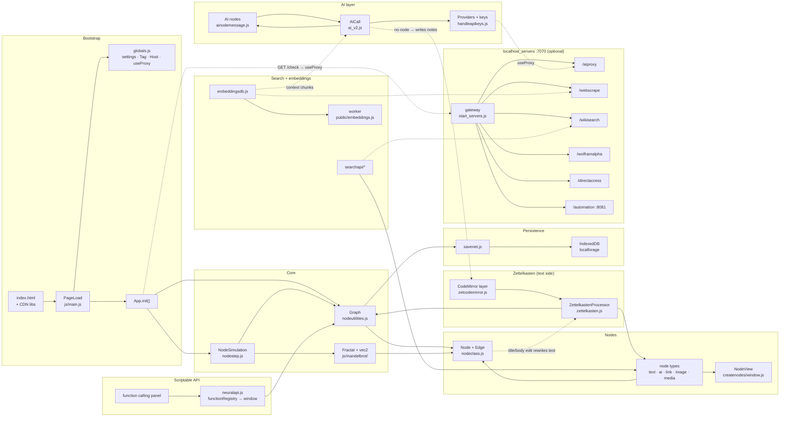

# Neurite — learning docs

Artifacts for understanding this codebase before changing it.

| File | What it is |
| --- | --- |
| [`architecture.html`](architecture.html) | Interactive component diagram. Click a component for its files, key symbols and neighbours; pick a *flow* to trace one path (boot, notes⇄nodes, AI request, save/load, search, render tick). Open it directly in a browser — no build, no dependencies. |
| this file | Same map as static text, for reading in a terminal or on GitHub. |
| [`handoff.md`](handoff.md) | Start here when picking up development with no memory of the last session: what to read, how to run and verify, how issues are picked, what landed recently, and the working rules for this fork. |
| [`adr/`](adr/) | Decisions that would otherwise get re-proposed. [`0001`](adr/0001-keep-the-hand-ordered-script-array.md) is why `PageLoad.scripts` stays a hand-ordered array. |

## The one-paragraph version

`index.html` loads a single script, `js/main.js`. Everything else — 81 more files — is fetched
sequentially at runtime by `PageLoad.scripts` into one shared global scope, so **load order is the
dependency graph and a file missing from that array never runs**. Once loaded, the app is a handful of
globals: `Graph` holds every node and edge plus the view transform, `Fractal` supplies the complex-plane
geometry those positions live in, `NodeSimulation` runs the single `requestAnimationFrame` loop, and
`ZettelkastenProcessor` keeps a CodeMirror document and the node graph as two views of the same thing.
The AI layer turns nodes into LLM calls; `localhost_servers` is an optional Express gateway that, when
detected, flips one global (`useProxy`) and moves API keys off the browser.

## Component map

## Suggested reading order

1. `js/main.js` — `PageLoad` (the loader), `App.init()` (the boot sequence), and the `On`/`Off`/`Elem`/`Request` helpers every other file uses.
2. `js/globals.js` — `settings`, `Stored`, `Tag`, `Host`, `useProxy`.
3. `js/nodes/nodeutilities.js` + `js/nodes/nodeclass.js` — what a node and the graph actually are.
4. `js/mandelbrot/mandelbrot.js` — `vec2` is complex arithmetic; node positions are points in the plane.
5. `js/nodes/nodeinteraction/nodestep.js` — the whole per-frame order of operations.
6. `js/zettelkasten/zettelkasten.js` — the bi-directional text⇄graph engine, the least guessable part.
7. `js/ai/ai_v2.js` + `js/ai/ai-utility/handleapikeys.js` — how a prompt becomes an HTTP call.

## Traps worth knowing before your first change

- **New file?** Add it to `PageLoad.scripts` in `js/main.js`, at a position after everything it touches at
  load time. Not listed = never executed, silently.
- **Need `import`/`export`?** Append `:MODULE` to the entry (`savenet.js:MODULE`), otherwise the file is a
  plain script.
- **Writing to CodeMirror from code?** Wrap the write: `processor.writeAs(ZettelkastenProcessor.Pass.rewrite,
  () => cm.setValue(...))`. The write is what triggers a parse, so the mode names what that parse should do.
- **New stateful widget on a node?** Register a `push_extra_cb` entry, or it silently disappears on reload —
  persistence replays `dataset.node_extras` through `Node.Extensions`.
- **Never hardcode `##` or `[[`.** They are `Tag.node` / `Tag.ref` and the user can change them.
- **Geometry goes through `vec2`** (`cmult`, `cadd`, `rot`), not plain x/y math.
- **No linter and no typechecker.** There are 42 tests under `test/`, run with `node --test test/*.test.js`
  — nothing under `js/` exports, so they read source as text or slice a class into a `node:vm` context.
  Everything else is verified in the browser at `http://localhost:8999`, or through
  `GET localhost:8081/screenshot` from the automation server.

See [`../CLAUDE.md`](../CLAUDE.md) for the same material aimed at coding agents, plus the naming and
callback conventions used throughout (`Logger.*`, `On.click`, `Html.new.div()`, the `this`-bound static
callback idiom).
